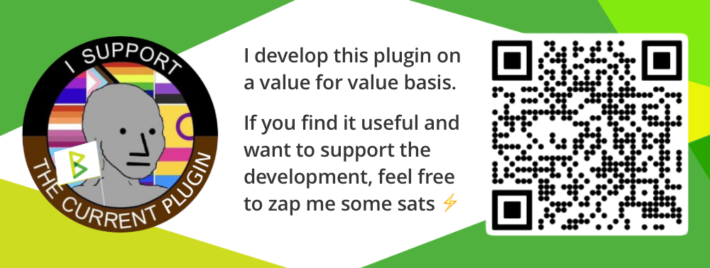

# Changelog

All notable changes to this project will be documented in this file.

The format is based on [Keep a Changelog](https://keepachangelog.com/en/1.0.0/),
and this project adheres to [Semantic Versioning](https://semver.org/spec/v2.0.0.html).

## [0.2.1]

### Changed

- Improve app integration.

## [0.2.0]

### Added

- Make PodServer available as an app, which lets you mount it to a domain.

## [0.1.6]

### Fixed

- Make links compatible with `rootpath` setting. (If BTCPay is deployed in a subdirectory)

## [0.1.5]

## Changed

- BTCPay Server-related updates.

## [0.1.4] - 2022-10-08

### Fixed

- Fix publish date in feed. (btcpayserver/btcpayserver-plugins#57)

## [0.1.3] - 2022-09-30

### Fixed

- Fix podcast lookup on public pages. (btcpayserver/btcpayserver-plugins#53)

## [0.1.2] - 2022-09-29

### Fixed

- Fix permissions. (btcpayserver/btcpayserver-plugins#49)

## [0.1.1] - 2022-09-28

### Fixed

- Fix public podcast page without episodes. (btcpayserver/btcpayserver-plugins#46)

## [0.1.0] - 2022-09-26

### Added

- Initial release. Please test, report issues and send feedback!
