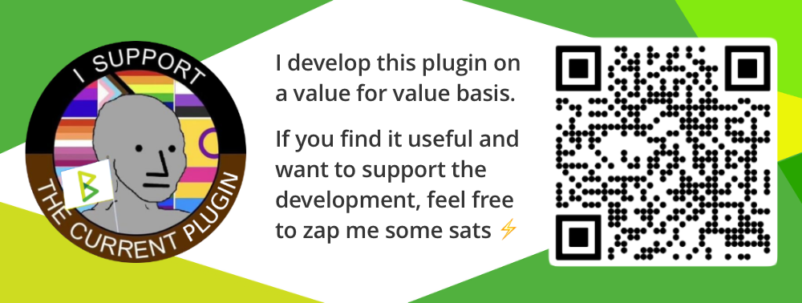

# PodServer

A plugin for [BTCPay Server](https://github.com/btcpayserver) to self-host your podcast and start Podcasting 2.0 like a pro.

## Use cases

- Self-host your podcast and earn sats via the Podcasting 2.0 features.
- Enjoy censorship resistance because you are in control of the feed and files.

## Technicalities

- In order to use PodServer, a file storage must be configured.

## Features and Compatibility

- Podcasting 2.0 tags: Value (podcast and episode level), Person, Season.
- Import existing feeds.

## Notes

- PodServer adds itself to the value splits with a value of `1`.
  This is to incentivice further development of the plugin.
  In the future this setting might become configurable, so that users can decide what split to allocate to PodServer on a value for value basis.

## How to activate and use PodServer

### Server admin

- PodServer has to be installed and activated by the server admin via the Plugins menu.
- When activated, PodServer is available to all users of the BTCPay Server instance.
- Requirements: BTCPay Server v1.6

### User

- Each user can create an unlimited number of podcasts.

## Support this plugin

